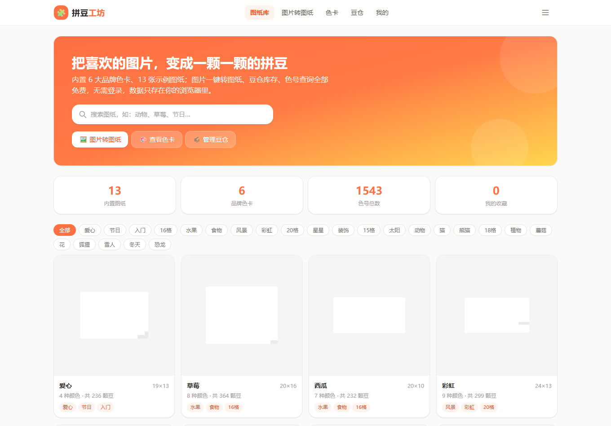
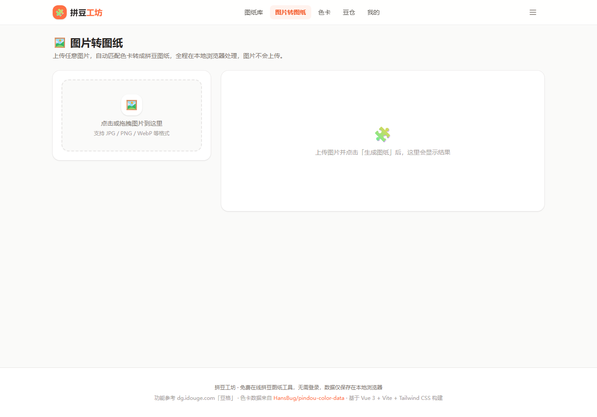
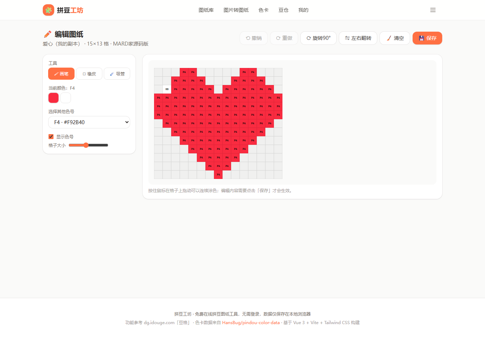
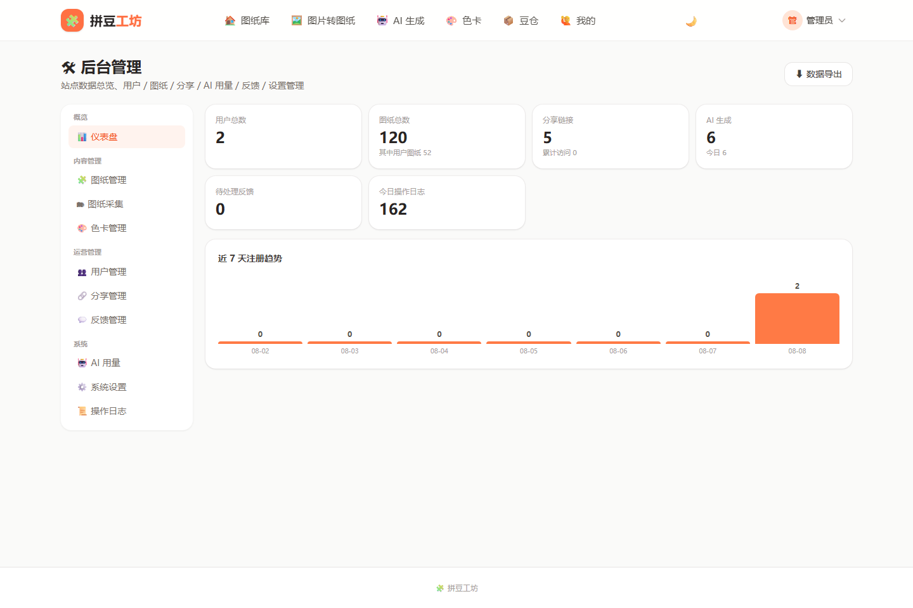

# 🧩 拼豆工坊 · Pindou Studio

拼豆（Perler / Hama 等融豆）图纸工具网站：**图纸库、图片一键转图纸、图纸编辑器、豆仓库存、品牌色卡与跨品牌换色、3D 预览、用豆统计 / 购物清单、短链分享**，并带有可选的**用户注册登录、跨设备云同步、AI 文生图 / 参考图重绘**和完整的**后台管理**（图纸库管理、图纸采集、功能开关、AI 限额、邮件服务、一键在线更新）。

## ✨ 功能

### 🏠 图纸库
- 内置 **56 张像素图纸**，支持后台新增、上架/下架、推荐置顶、维护标签与来源
- 支持从外部画廊站点**采集入库**（Perler、BeadPattern、BeadsCanvas、MakeBead 等，可勾选来源、预览后再导入）
- 搜索、标签筛选、**难度 / 豆数筛选**、分页浏览（默认每页 16 张，每页数量可调）

### 🖼️ 图片转图纸
- 上传任意图片 → **可选上传前裁剪**（拖拽选区 / 手柄缩放）+ 边缘锐化 + 色彩增强（亮度 / 饱和度 / 对比度）+ 细节超采样（1 / 2 / 3 倍）+ **画布宽度 16~256 自由缩放**
- **背景处理**：默认背景留空（边缘连通智能抠图，只去掉外围背景、图案内部保留），默认自动裁剪空白边距
- **仅用手头颜色生成**：豆仓里没有的色号自动映射到最近的有色
- **底板尺寸 / 板数规划**：29×29 / 50×50 / 104×104，自动计算需要几块板
- 最近色 / **Floyd-Steinberg 抖动量化** → 生成图纸
- 生成后可：**✨ 一键拼豆风**、**🔁 切换品牌色卡并重映射**、**🎨 颜色优化**（合并相似色 / 去杂色 / 逐色排除与重映射）、**🧮 库存对照**（每种颜色用多少豆 / 豆仓还差多少）

### 🧮 图纸详情
- 网格预览（色号 / 网格开关、格子大小、按底板算板数）、用豆统计、缺豆提醒
- **🧭 拼豆进度追踪**：逐颗标记已放，支持按住拖动连续标记、Shift+拖拽框选，进度自动保存到本地
- **🔁 跨品牌换色卡**：一键转成 Perler / Hama 等任意色卡并保存副本
- **🛒 购物清单 / BOM**：需要 / 已有 / 需购，按豆仓库存算"差几颗需买"，支持打印与 CSV 导出
- **🧊 3D 预览**：立体豆子效果，可放大缩小 50%~300% 并下载 PNG
- **⬇ 透明背景 PNG**、**⬇ 底板布局图**（按板分割并编号）、下载图纸图片**顶部二维码**（可勾选关闭）

### ✏️ 图纸编辑
- 画笔 / 橡皮 / 吸管 / **油漆桶**（泛洪填充）/ **框选**（复制 / 剪切 / 粘贴 / 删除，Ctrl+C / X / V）
- **左右 / 上下对称绘制**、**放大镜**（悬停看局部 7×7）、全局颜色替换、旋转 90°、左右翻转、清空
- **撤销 / 重做**（按钮 + Ctrl+Z / Ctrl+Shift+Z / Ctrl+Y）、**坐标 / 参考线开关**
- **← 退出**（有未保存改动先确认）、移动端触摸涂色优化（防误触）

### 📦 豆仓
- 按品牌色卡登记你拥有的豆子颜色与数量，支持**批量修改库存**
- 与图片转图纸、图纸详情联动：自动计算"每种颜色用多少 / 已有多少 / 差多少 / 需购多少"

### 🎨 色卡
- **20 套品牌色卡共 4600+ 色号**（MARD、COCO、DODO、卡卡、漫漫、盼盼、咪小窝、小舞、黄豆豆、柿柿、童趣、优肯、Perler、Hama、Nabbi）
- **🧪 自定义调色板**：自己创建色卡（增删色号 + 颜色），保存后可在生成器 / 换色卡中使用
- 颜色选色 → 跨品牌查找最接近色号

### 🙋 我的
- 收藏 + 我的图纸，本地持久化；**自动去重**、**批量管理**（多选 / 全选 / 批量收藏 / 删除 / 批量移动分组）
- **📁 分组**（收藏 / 图纸按组筛选、加入分组）
- **⇪ 导入图纸**（粘贴色号网格 / JSON / 字符画）

### 👤 用户与后台
- **注册 / 登录**、**个人中心**（资料 / 改密 / AI 用量 / 云同步 / 我的分享 / 注销）、**忘记密码**（SMTP 邮件找回）
- **☁️ 跨设备云同步**：图纸 / 收藏 / 分组 / 豆仓库存，注册后自动同步
- **🎁 积分**：每日签到、连续签到奖励、积分兑换 AI 额度
- **🛠 后台管理**（`/admin`，仅管理员）：
  - 仪表盘 / 用户 / 图纸 / 分享 / AI 用量 / 反馈 / 操作日志管理（均支持**批量操作**）
  - **图纸采集**（多来源、预览后再入库）、**色卡管理**
  - **系统设置**：站点公告、维护模式、注册开关、6 项功能开关（图纸库 / 图片转图纸 / AI 生成 / 色卡 / 豆仓 / 分享）、游客与用户 AI 每日限额、SMTP 邮件服务、AI 服务地址与密钥配置
  - **数据导出**（全量 JSON 备份）
  - **版本更新**：检测 GitHub 新版本，一键在线更新（拉代码 → 装依赖 → 构建前端 → 重启服务，执行日志实时显示）

### 🤖 AI 生成（可选，需后端 + 通义千问 API Key）
- **文字描述生成图纸**（wanx2.1-t2i-turbo）
- **参考图模式**（img2img：上传参考图，按描述重绘）
- 每日次数限制（游客 / 登录用户，后台可调整），生成历史可在个人中心查看 / 删除

## 🖼 截图

| 图纸库 | 图片转图纸 | 图纸编辑 | 后台仪表盘 |
| --- | --- | --- | --- |
|  |  |  |  |

## 🛠 技术栈

- **构建**：[Vite 7](https://vitejs.dev) + [Vue 3](https://vuejs.org)（`<script setup>` 组合式 API）+ TypeScript
- **路由**：vue-router（History 模式，网址无 `#/`，任意静态服务器 / 托管平台可直接部署）
- **样式**：[Tailwind CSS v4](https://tailwindcss.com)（`@tailwindcss/vite` 插件）+ 少量自定义 CSS
- **前端状态**：轻量响应式 store（`composables/useStore.ts`）+ `localStorage`（图纸 / 收藏 / 分组 / 豆仓库存），登录后可通过后端云同步
- **图像处理**：HTML5 Canvas 读像素 + **CIEDE2000 色差公式**最近色匹配、Floyd–Steinberg 误差扩散抖动、Web Worker 量化；大图纸（>3000 格）自动用 Canvas 渲染避免 DOM 卡顿
- **后端**：`server/`（Express 5 + Node 24 内置 `node:sqlite` + JWT + bcryptjs），提供注册登录、云同步、分享、AI 生成与用量、积分、图纸库 / 采集 / 后台管理等 API；零原生编译依赖
- **数据**：前端 `localStorage` + 后端 SQLite（`server/data/pindou.db`：用户 / 云端图纸 / 分享 / 反馈 / 后台配置）

## 🚀 运行

```bash
npm install        # 安装依赖
npm run server     # 启动后端 http://localhost:8787（分享跨设备 / AI / 登录注册 / 云同步 / 后台管理需要）
npm run dev        # 开发服务器 http://localhost:5173（/api 已代理到 8787）
npm run build      # 类型检查 + 生产构建到 dist/
npm run preview    # 预览生产构建
```

> - 首次启动后端会自动建库并创建默认管理员：`admin / admin123`（登录后请在后台尽快修改密码）。
> - AI 功能需在项目根目录 `.env` 配置（见 `.env.example`）：`DASHSCOPE_API_KEY`（必填）、`WANX_MODEL`（默认 `wanx2.1-t2i-turbo`）、`VISION_MODEL`（默认 `qwen-vl-max`）；邮件找回密码需配置 `SMTP_HOST / SMTP_PORT / SMTP_USER / SMTP_PASS / FRONTEND_URL`（也可在后台「系统设置 → 邮件服务」中配置）。
> - 不启动后端时，图纸库、图片转图纸、色卡、豆仓、编辑等核心功能照常可用（数据保存在本地浏览器）。

## 🌐 部署

前端 `dist/` 为纯静态文件，可部署到 GitHub Pages / Netlify / Vercel / Nginx 等任意地方；后端为 Node 服务（建议 Node 24.x），可部署到任意主机 / VPS。

**Linux 宝塔面板 + Nginx + PM2 + Node 24 的完整部署与运维说明见 [`DEPLOY.md`](DEPLOY.md)**，包含：反向代理配置、HTTPS、数据备份、发版更新流程，以及后台「版本更新」一键在线更新的前提条件。

## 🧪 测试

依赖 Chrome / Edge，脚本会用系统浏览器做无头测试：

```bash
node scripts/smoke.cjs       # 页面路由 + 搜索 + 收藏冒烟测试
node scripts/deep-test.cjs   # 上传→生成→颜色优化→裁剪→A4 打印→库存→编辑→导入→拼豆进度→换色卡→购物清单 全流程
node scripts/screenshots.cjs # 生成页面截图到 screenshots/
```

## 📁 目录结构

```
src/
  components/   PatternGrid（div/canvas 自适应）、PatternCard、ColorLegend、Bead3DPreview、ImageCropper
  composables/  useStore.ts（收藏/图纸/库存 本地状态）、useAuth.ts、useConfig.ts（公开配置/功能开关）
  data/         palettes/（20 套色卡 JSON）、patterns.json（内置图纸）等
  utils/        color.ts（CIEDE2000）、quantize.ts（量化 worker）、export.ts（PNG/CSV/打印）、api.ts、storage.ts
  views/        Home / Generator / PatternDetail / Editor / Warehouse / Palette / My /
                AiView / AuthView / ProfileView / AdminView / SharedView / ResetPasswordView
  router/       路由（History 模式）
  App.vue       顶部导航 + 页脚 + 全局主题（深色模式）
server/
  index.mjs      Express 入口（路由 + 鉴权 + 静态托管）
  app.mjs        业务路由（auth / sync / share / ai / points / admin / collect / update…）
  auth.mjs       JWT + 密码哈希
  db.mjs         建库与种子数据（node:sqlite）
  collector.mjs  图纸采集（Perler / BeadPattern / BeadsCanvas / MakeBead 等画廊站点，支持直取完整网格）
  update.mjs     在线更新（git 拉取 + 构建 + PM2 重启 + 状态/日志）
scripts/         smoke / deep-test / screenshots 测试脚本、预构建清理
```

## 📝 说明

- 图纸与色号数据仅供学习交流，请勿商用色卡数据本身。
- 颜色匹配基于 CIEDE2000，视觉最接近；实际豆子颜色受批次 / 屏幕影响，建议以实物为准。
